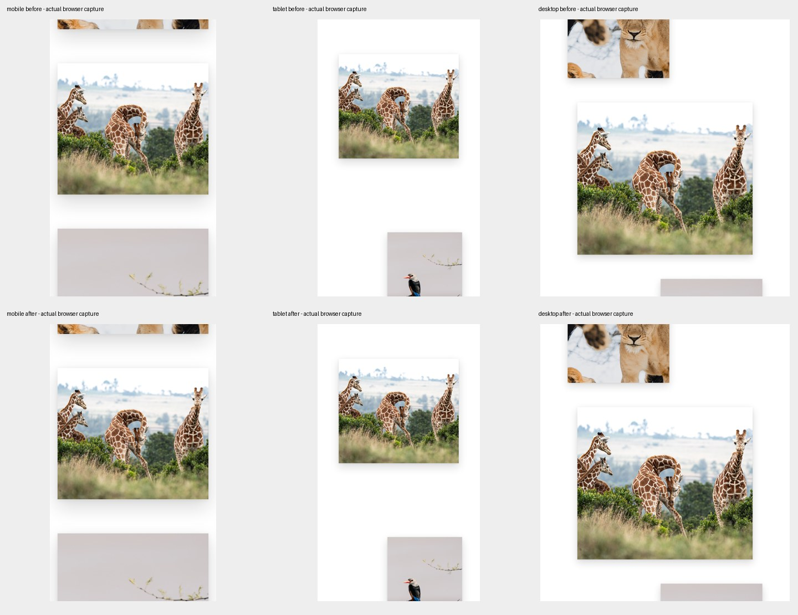
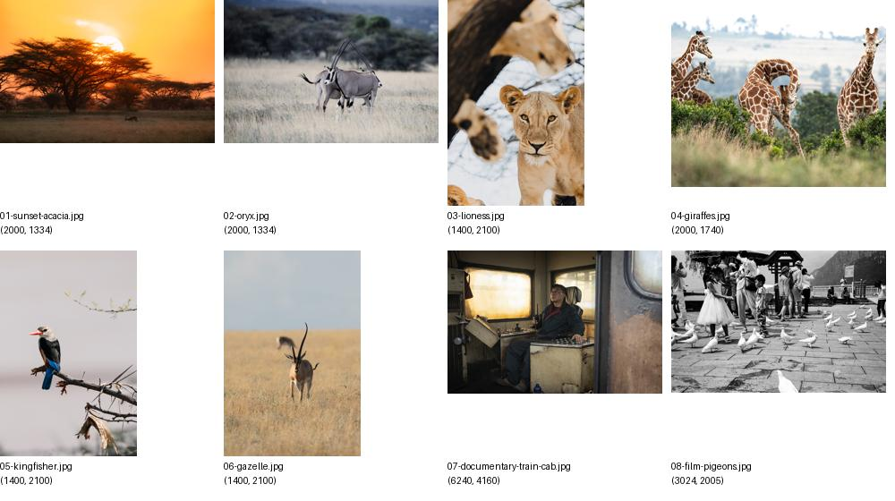

# Photo layout review

This draft is a partial layout fix against main `1923577`. It is not ready to replace the live site's larger catalog.

- Intrinsic dimensions separate orientation from editorial alignment. Horizontal photos use 74vw (up to 1180px) on larger screens and the available width on mobile, with no subject cropping.
- The first image remains eager; subsequent images load lazily with dimensions reserved. Existing covers, order, categories and source files are preserved.
- All four routes were checked in Chromium at 390×844, 820×1180 and 1440×1000: images decoded successfully, original aspect ratios retained, no horizontal overflow. Both left and right alignment were separately verified to retain the generous horizontal width.
- `npm run build` passed. `npm run lint` passed with the existing `src/locale.tsx:46` Fast Refresh warning. `git diff --check` passed.

Measurements for all routes and viewport sizes are in `before-measurements.json` and `after-measurements.json`.

## Blocked catalog work

The current main has only eight photos: Documentary 1, Landscape 1, Wildlife 5 and Film 1 (a photograph, not video). It has none of the DSC-named files from the requested 231-item review. There were no open PRs or other remote branches when checked. No repository AGENTS.md or .agents/skills instructions were present.

The public Workers site returned HTTP 403 from this environment, including an additional network access attempt; the web reader could not access it either. Therefore the full series order, the 16 known duplicate displays and the seven requested category moves have not been changed or visually accepted. Distinct similar frames have not been removed.

To finish: provide the source revision/export powering the live site, including its full photo manifest and accessible published images (or restore public-site access). No credentials or private originals are needed. Then visually curate every category, preserve chosen covers, apply the approved deduplication/moves, and repeat responsive checks against that complete catalog.
